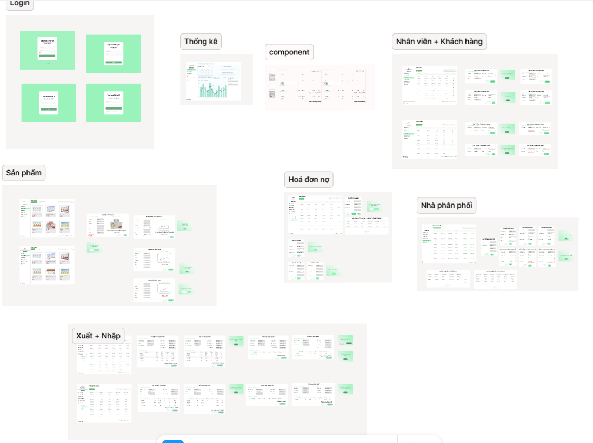
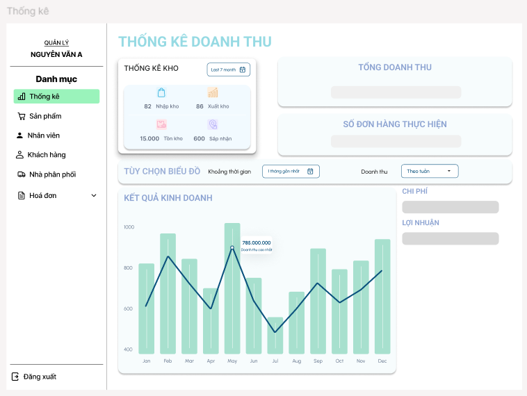

   
<h2 align="center">Hệ thống quản lý quy trình kinh doanh</h2>
 
  > ✍ Đây là dự án được thực hiện cùng với team trong quá trình học tập
<h3>📝 Mô tả dự án</h3>

 
  
> 📫 Đây là một hệ thống quản lý quy trình kinh doanh được thiết kế dành cho một tiệm tạp hóa chuyên bán sỉ và lẻ. Dự án nhằm mục tiêu hỗ trợ cửa hàng kiểm soát chặt chẽ các hoạt động xuất nhập hàng hóa, theo dõi tồn kho và cập nhật tình trạng mặt hàng theo thời gian thực.

> 📫 Bên cạnh đó, hệ thống còn quản lý thông tin và giao dịch với các bên liên quan như nhà cung cấp và khách hàng (bao gồm cả khách sỉ và lẻ), giúp chủ cửa hàng dễ dàng tra cứu lịch sử mua bán, tối ưu hóa quy trình kinh doanh và nâng cao hiệu quả vận hành.

<h3>🎯 Mục tiêu dự án</h3>
<ul>
  <li>Quản lý sản phẩm, đơn hàng, hóa đơn</li>
  <li> Quản lý các bên giao dịch liên quan: khách hàng và nhà cung cấp</li>
  <li> Tối ưu quy trình bán hàng và chăm sóc khách hàng</li>
  <li> Tăng hiệu suất kinh doanh và giảm thiểu vấn đề sai sót trong quản lý cửa hàng</li>
</ul>
<h3> 🚀 Tính năng chính</h3>
<ul>
  <li> Đăng ký/ Đăng nhập người dùng</li>
  <li>Quản lý doanh thu, hóa đơn, sản phẩm</li>
  <li>Phân quyền người dùng </li>
  <li>Quản lý khách hàng và nhà cung cấp</li>
  <li> Thống kê doanh thu theo thời gian</li>
</ul>
<h3>🛠️ Công nghệ sử dụng</h3>

  
  
  
  
  

<h3>📖 Ngôn ngữ sử dụng</h3>

  

     <h5>🛠️Font-End & Back-end</h5>
    

    
     
       
      
      
    

  

<h3>👨‍💻 Vai trò của tôi</h3>
<ul>
<li> Leader dự án: Lên ý tưởng, thiết kế sườn cho dự án </li>
<li>Làm việc với khách hàng, thu thập yêu cầu </li>
<li> Thiết kế và xây dựng cơ sở dữ liệu </li>
<li> Thiết kế và xây dựng hệ thống frontend và backend </li>
<li> Dump dữ liệu mẫu vào hệ thống. </li>
<li> Triển khai xác thực, phân quyền người dùng </li>
<li> Tối ưu giao diện người dùng (UI/UX)</li>
</ul>
<h3>📸 Hoạt động dự án</h3>

  
  
  
  

<h4>Hình ảnh demo</h4>
<table style="width:100%;">
  <tr>
    <td>
      
      
    </td>
    <td>
      
 
        
      

    </td>
  </tr>
</table>

